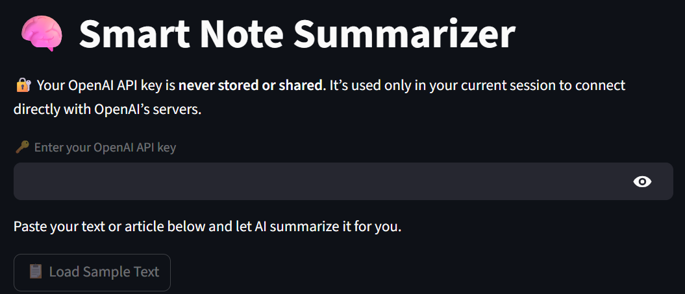
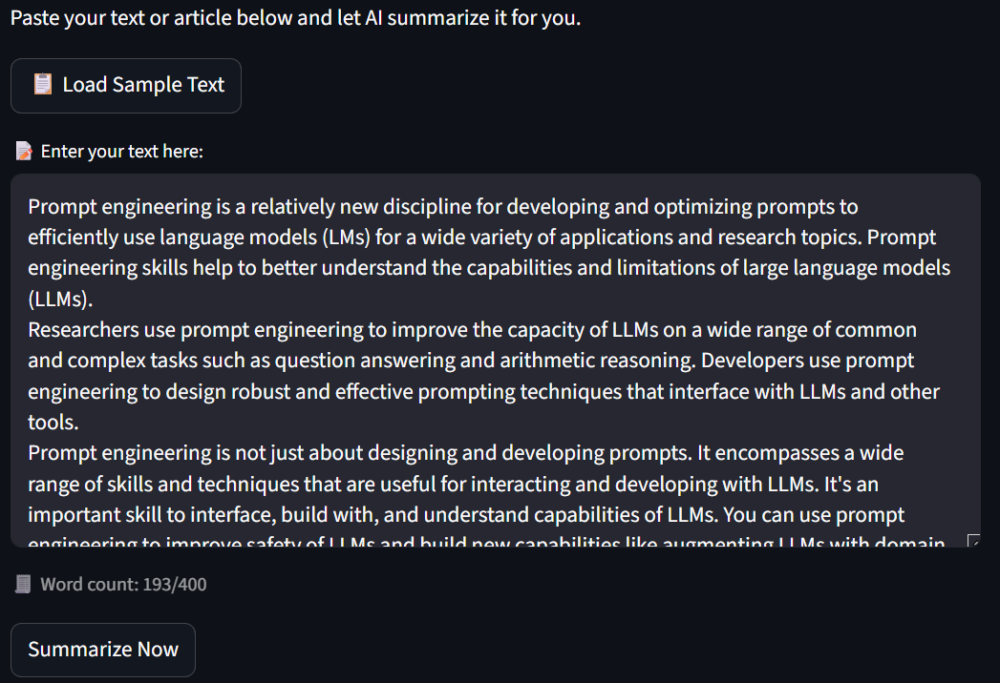
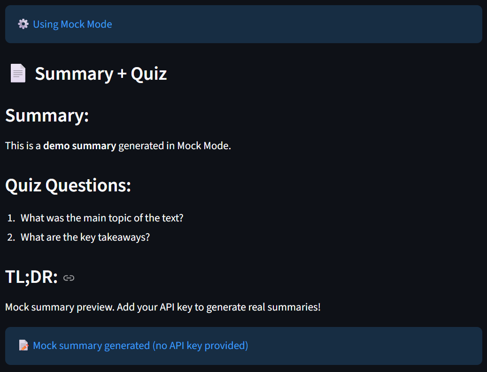

# 🧠 Smart Note Summarizer

An AI-powered text summarization tool built with Streamlit and OpenAI's GPT-4o-mini. Transform long articles and notes into concise summaries with generated quiz questions.

Learning - api integration, prompt engineering, error handling, token cost calculation


## ✨ Features

- 📝 **Smart Summarization**: Converts long text into clear, concise summaries
- 🎯 **TL;DR Generation**: Get the key points in 3 lines
- ❓ **Quiz Questions**: Auto-generated questions to test understanding
- 💰 **Cost Estimation**: Real-time API cost calculation
- 🔒 **Privacy First**: API keys are never stored or shared
- 🎨 **Usage Plans**: Free, Basic, and Pro tiers with word limits
- 🧪 **Mock Mode**: Try the app without an API key

## 🛠️ Tech Stack

- **Frontend**: Streamlit
- **AI Model**: OpenAI GPT-4o-mini
- **Language**: Python 3.8+

## 📦 Installation

1. **Clone the repository**

```bash
git clone https://github.com/YOUR_USERNAME/smart-note-summarizer.git
cd smart-note-summarizer
```

2. **Create a virtual environment**

```bash
python -m venv venv
source venv/bin/activate  # On Windows: venv\Scripts\activate
```

3. **Install dependencies**

```bash
pip install -r requirements.txt
```

## 🚀 Usage

1. **Run the app**

```bash
streamlit run app.py
```

2. **Open your browser** at `http://localhost:8501`

3. **Enter your OpenAI API key** (or try Mock Mode)

4. **Paste your text** or click "Load Sample Text"

5. **Click "Summarize Now"** and get instant results!

## 📋 Usage Plans

| Plan  | Max Words | Best For                        |
| ----- | --------- | ------------------------------- |
| Free  | 400       | Short articles, quick summaries |
| Basic | 2000      | Medium-length content           |
| Pro   | 5000      | Long-form articles and reports  |

## 🔑 Getting an OpenAI API Key

1. Go to [OpenAI Platform](https://platform.openai.com/)
2. Sign up or log in
3. Navigate to API keys section
4. Create a new secret key
5. Add credits to your account (minimum $5 recommended)

## 💡 Example Use Cases

- Summarize research papers for quick review
- Condense meeting notes into action items
- Create study materials from long articles
- Generate quiz questions for learning
- Extract key insights from blog posts

## 📁 Project Structure

```
smart_note_summarizer/
├── app.py              # Main Streamlit application
├── summarizer.py       # Core summarization logic
├── prompts.py          # System and user prompts
├── requirements.txt    # Python dependencies
├── .gitignore         # Git ignore rules
└── README.md          # Project documentation
```

## 🎨 Screenshots







## 🚧 Roadmap

- [ ] Add support for file uploads (PDF, TXT, DOCX)
- [ ] Multiple summary length options
- [ ] Export summaries as PDF/Markdown
- [ ] Support for other LLM providers
- [ ] Batch processing for multiple texts

## 🤝 Contributing

Contributions are welcome! Please feel free to submit a Pull Request.

## 👨‍💻 Author

**Your Name**

- GitHub: [@its-me-koustubhya](https://github.com/its-me-koustubhya)
- Portfolio: [Smart-Note-Summarizer.com](https://your-website.com)

## 🙏 Acknowledgments

- Built as part of the AI Engineer Roadmap
- Powered by OpenAI's GPT-4o-mini
- UI framework by Streamlit

## 📞 Support

If you have any questions or run into issues, please open an issue on GitHub.

---

⭐ If you find this project helpful, please consider giving it a star!
